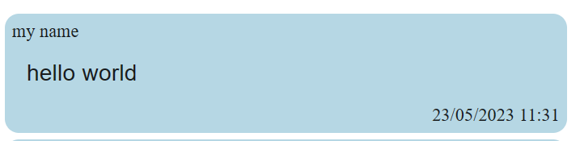

# Laboratorium - React & Socket.io
    Aleksandra Łapczuk, Filip Korus

# Przygotowanie środowiska

### 1. Edytor kodu

#### Sposób I - edytor w przeglądarce - czasem się crashuje bo chmura ma mało pamięci RAM.
- otwórz przeglądarkowy edytor [replit](https://replit.com/)
- niezbędne jest założenie tam konta
- kolejnym krokiem jest utworzenie projektu - w tym celu kliknij na przycisk `+ Create Repl`
- z zakładki `Templates` wybierz `Node.js` **WAŻNE!!!**
- nadaj nazwę i zapisz projekt
- od tego momentu wszystkie polecenia należy wykonać w tym środowisku

#### Sposób II - szybszy i bardziej niezawodny, ale mniej wygodny niż sposób I (trzeba coś zainstalować :()
- sprawdź zainstalowaną na Twoim komputerze wersję Node.js (komenda `node --version`) -> jeśli na ekranie pojawił się numer wersji pomiń następny krok
- jeśli na Twoim komputerze nie ma zainstalowanego Node.js trzeba go zainstalować - w tym celu kliknij na wybrany instalator i zainstaluj Node.js: [Windows 64-bit](https://nodejs.org/dist/v16.16.0/node-v16.16.0-x64.msi), [Linux](https://nodejs.org/dist/v16.16.0/node-v16.16.0-linux-x64.tar.xz), [MacOS Intel 64-bit](https://nodejs.org/dist/v16.16.0/node-v16.16.0-darwin-x64.tar.gz)

### 2. Uruchomienie projektu
- Za pomocą polecenia `git clone https://github.com/filipkorus/JPWP-tasks.git` sklonuj kod startowy.
- Jeśli pracujesz w środowisku lokalnie, u siebie na komputerze otwórz Visual Studio Code w folderze z projektem.
- Wejdź w folder `zadania` (`cd JPWP-tasks/zadania/`).
- Zainstaluj potrzebne pakiety npm (`npm install`).
- Uruchom aplikację (`npm run start`). W przeglądarce powinno otworzyć się okno z projektem.
- W trakcie wykonywania zadań warto mieć włączone DevTools (np konsolę) w oknie przeglądarki z aplikacją.

# Zadanie 1
## Interfejs graficzny

### Stwórz UI komponentu Message (znajduje się on pod ścieżką `src/components/`).
- powinien on wyświetlać imię autora, treść wiadomości oraz datę jej wysłania
- data powinna być sformatowana w wybrany przez Ciebie sposób
- wykorzystaj do tego komponenty [Material UI](https://mui.com/material-ui/) oraz inne tagi JSX/TSX
- pamiętaj, że piszemy w TypeScript, a nie JS
- postaraj się stworzyć UI podobne do tego na zdjęciu niżej

##### Jako dowód wykonania zadania wyślij zrzuty ekranu z kodem (plik `src/component/Message.tsx`) oraz okno przeglądarki ze stworzonym UI.

# Zadanie 2
## Emitowanie wiadomości za pomocą socket.io.

#### Przydatne linki:
- [emitting events in socket.io](https://socket.io/docs/v3/emitting-events/)
- [spread operator](https://www.w3schools.com/react/react_es6_spread.asp)

####  Będziemy pracować na pliku `src/components/ChatWindow.tsx`
- podmień wartość zmiennej `const authorName = 'my name';` na swoje imię lub nr indeksu
- w częściowo zaimplementowanej funkcji `handleSubmit(text: string)` mamy dostęp do zmiennej `text`
- ta funkcja jest wykonywana kiedy ktoś wciśnie przycisk wysyłania wiadomości - w zmiennej `text` będzie to co użytkownik wpisał do pola tekstowego - to nasza wiadomość, którą chcemy wysłać.
- za pomocą zmiennej `socket` należy emitować event o nazwie `send-message` i jako jego ciało przesłać obiekt zawierający imię autora oraz treść wiadomości (zmienna `text` z punktu wyżej)
- wysyłany obiekt powinien wyglądać tak: `{author: 'imie autora', content: 'tresc wiadomosci'}`.
- kolejnym krokiem jest dodanie obiektu wiadomości (`newMessage`) do naszego UI za pomocą settera `setMessages` z `useState`. W zmiennej `messages` chcemy zachować poprzednie wiadomości oraz dodać nową.

##### Jako dowód wykonania zadania wyślij zrzuty ekranu z kodem (plik `src/component/ChatWindow.tsx`) oraz okno przeglądarki z zaimplementowaną przez Ciebie funkcjonalnością.

# Zadanie 3
## Odbieranie nowych wiadomości za pomocą socket.io.

#### Przydatne linki:
- [listening to events in socket.io](https://socket.io/docs/v3/listening-to-events/)

####  Tutaj również będziemy pracować na pliku `src/components/ChatWindow.tsx`
- w ciele funkcji hooka `useEffect` (pod komentarzem `/* listen for incoming messages */`) należy nasłuchiwać socketowego eventu o nazwie `receive-message`, którego handler będzie zawierał zmienną - obiekt typu `IMessage`.
- przychodzący obiekt wiadomości należy dodać do UI za pomocą settera `setMessages` z `useState` z użyciem spread operator - identycznie jak w poprzednim zadaniu
- niezbędnym punktem nasłuchiwania eventów jest także ich czyszczenie (zapobiega to memory leak) za pomocą cleanup function

##### Jako dowód wykonania zadania wyślij zrzuty ekranu z kodem (plik `src/component/ChatWindow.tsx`) oraz okno przeglądarki z zaimplementowaną przez Ciebie funkcjonalnością.

# Zadanie 4
## Submitowanie pola tekstowego za pomocą klawisza Enter.

#### Będziemy pracować na pliku `src/components/InputField.tsx`
- uzupełnij jedynie kod w funkcji `handleKeyDown(event: React.KeyboardEvent<HTMLDivElement>)`
- sprawdź czy wciśnięty przycisk (key - pole zmiennej event) to klawisz Enter
- następnie użyj funkcji `event.preventDefault();`, aby zapobiec domyślnemu zachowaniu przeglądarki po wciśnięciu klawisza - w tym przypadku Entera
- sprawdź czy długość wiadomości jest większa od zera
- wywołaj funkcję przekazaną z props, która wyśle wiadomość tak samo jak kliknięcie przycisku *send message*
- wyczyść zawartość zmiennej text, aby wyczyścić pole tekstowe
- sprawdź czy po wpisaniu wiadomości i wciśnięciu Entera wiadomość się wysyła

##### Jako dowód wykonania zadania wyślij zrzuty ekranu z kodem funkcji `handleKeyDown = (event: React.KeyboardEvent<HTMLDivElement>)` (plik `src/component/InputField.tsx`).

# Dziękujemy za udział w demonstracji.
